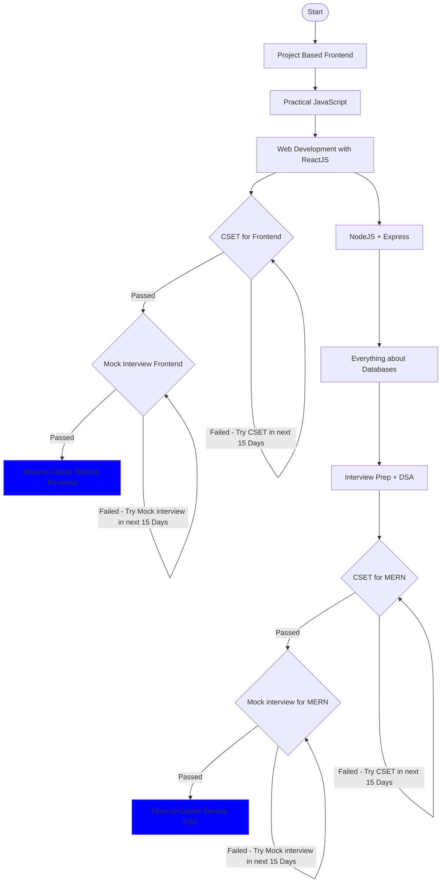

```mermaid
flowchart TD
    Start([Start])
    Start --> ProjectFrontEnd[Project Based Frontend]
    ProjectFrontEnd --> PracticalJavaScript[Practical JavaScript]
    PracticalJavaScript --> React[Web Development with ReactJS]
    React --> CSETFrontend{CSET for Frontend}
    CSETFrontend --> |Passed| MockFrontend{Mock Interview Frontend}
    MockFrontend --> |Passed| CSPFrontend[Move to Career Service Frontend]
    MockFrontend --> |Failed - Try Mock interview in next 15 Days| MockFrontend
    CSETFrontend --> |Failed - Try CSET in next 15 Days| CSETFrontend
    React --> NodeJS[NodeJS + Express]
    NodeJS --> Database[Everything about Databases]
    Database --> DSA[Interview Prep + DSA]
    DSA --> CSETMERN{CSET for MERN}
    CSETMERN --> |Passed| MockMERN{Mock interview for MERN}
    CSETMERN --> |Failed - Try CSET in next 15 Days| CSETMERN
    MockMERN --> |Passed| CSPMERN[Move to Career Service FSD]
    MockMERN --> |Failed - Try Mock interview in next 15 Days| MockMERN
    style CSPFrontend fill:#00f
    style CSPMERN fill:#00f
```
